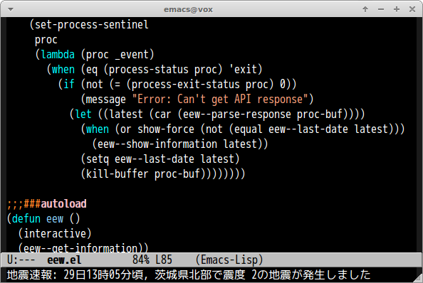

# eew.el

Japanese Earthquake Early Warning for Emacs

## Screenshot

## Commands

#### `M-x eew`

Show Japanese earthquake early warning if it is updated from last time.
Show information force by `C-u` prefix.
